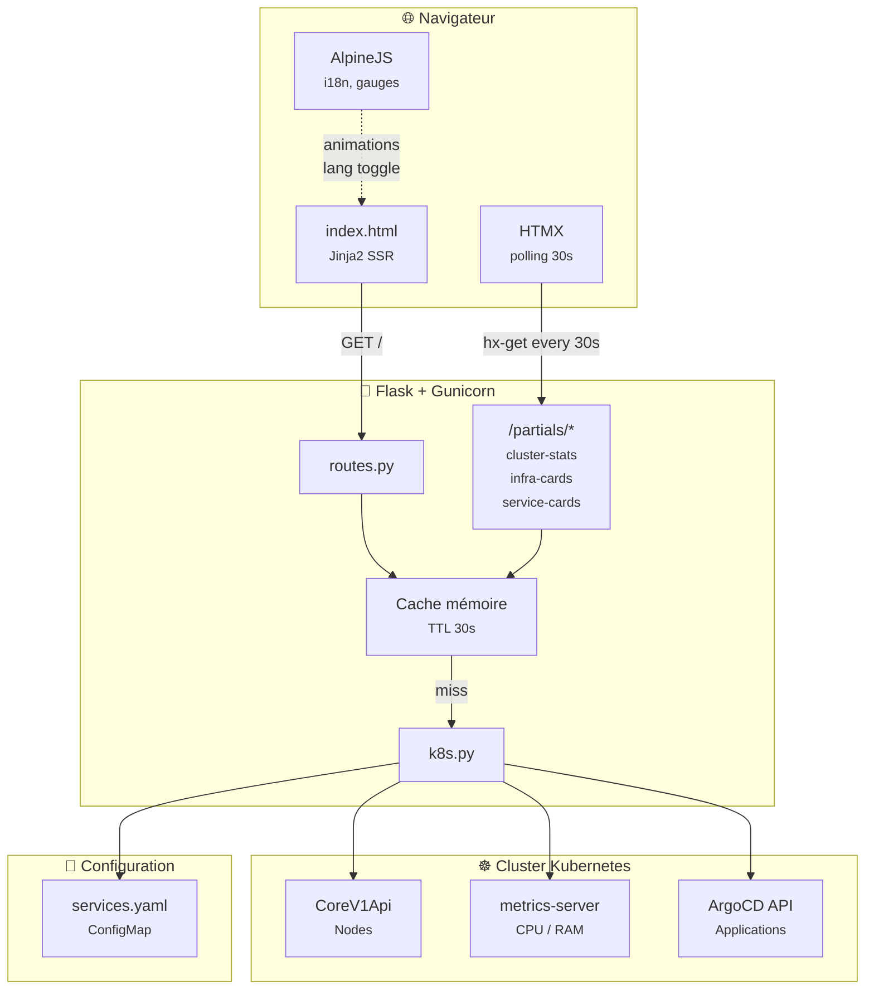
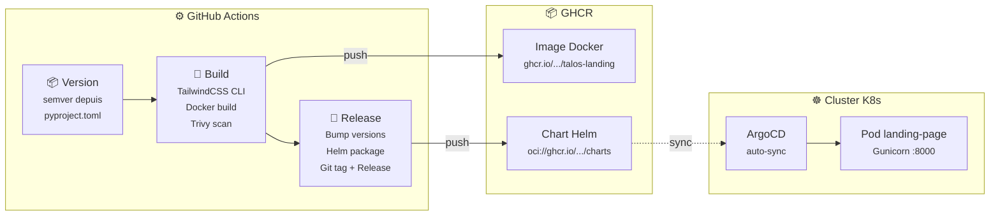

# talos-landing

> **https://taloslab.cc**

Landing page pour le homelab Kubernetes **taloslab.cc** — affiche en temps réel les métriques du cluster, les composants d'infrastructure et les services déployés.

## Stack

| Couche   | Technologie                                      |
| -------- | ------------------------------------------------ |
| Backend  | Flask + Gunicorn                                 |
| Frontend | Jinja2 SSR, HTMX, TailwindCSS v4, AlpineJS       |
| Données  | Kubernetes API (nodes, metrics-server, ArgoCD)   |
| Design   | Glassmorphism, Plus Jakarta Sans, JetBrains Mono |

## Architecture

App



Build & Release



## Fonctionnalités

- Métriques cluster live (uptime, noeuds, CPU, RAM) via l'API Kubernetes
- Statut des composants infra synchronisés depuis ArgoCD
- Cartes de services publics avec health check en direct
- Rafraîchissement automatique toutes les 30s (HTMX polling)
- Interface bilingue FR/EN (AlpineJS)

## Développement

```bash
# Installer les dépendances
uv sync

# Lancer le serveur de dev
uv run flask --app app run --debug

# Build CSS (nécessite Devbox)
devbox run css:build   # Build minifié
devbox run css:watch   # Watch mode
```

## Docker

```bash
docker build -t talos-landing .
docker run -p 8000:8000 talos-landing
```

## Configuration

| Variable               | Défaut                  | Description                        |
| ---------------------- | ----------------------- | ---------------------------------- |
| `CACHE_TTL_SECONDS`    | `30`                    | TTL du cache des données K8s       |
| `SERVICES_CONFIG_PATH` | `/config/services.yaml` | Chemin vers la config des services |

## Structure

```
app/
├── __init__.py          # Factory Flask
├── config.py            # Variables de configuration
├── k8s.py               # Client Kubernetes (nodes, metrics, ArgoCD)
├── routes.py            # Routes Flask + partials HTMX
├── static/css/          # TailwindCSS (input + build)
└── templates/
    ├── base.html         # Layout principal
    ├── index.html        # Page d'accueil
    └── partials/         # Fragments HTMX (cluster_stats, infra_cards, service_cards)
config/
└── services.yaml        # Métadonnées des services exposés
```
