# talos-landing

> **https://taloslab.cc**

Landing page pour le homelab Kubernetes **taloslab.cc** — affiche en temps réel les métriques du cluster, les composants d'infrastructure et les services déployés.

## Stack

| Couche   | Technologie                                      |
| -------- | ------------------------------------------------ |
| Backend  | Flask + Gunicorn                                 |
| Frontend | Jinja2 SSR, HTMX, TailwindCSS v4, AlpineJS       |
| Données  | Kubernetes API (nodes, metrics-server, ArgoCD)   |
| Design   | Glassmorphism, Plus Jakarta Sans, JetBrains Mono |

## Architecture

App

```mermaid
flowchart TB
    subgraph Browser["🌐 Navigateur"]
        HTML["index.html<br/><small>Jinja2 SSR</small>"]
        HTMX["HTMX<br/><small>polling 30s</small>"]
        Alpine["AlpineJS<br/><small>i18n, gauges</small>"]
    end

    subgraph Flask["🐍 Flask + Gunicorn"]
        Routes["routes.py"]
        Partials["/partials/*<br/><small>cluster-stats<br/>infra-cards<br/>service-cards</small>"]
        Cache["Cache mémoire<br/><small>TTL 30s</small>"]
        K8sClient["k8s.py"]
    end

    subgraph K8s["☸ Cluster Kubernetes"]
        Nodes["CoreV1Api<br/><small>Nodes</small>"]
        Metrics["metrics-server<br/><small>CPU / RAM</small>"]
        Argo["ArgoCD API<br/><small>Applications</small>"]
    end

    subgraph Config["📄 Configuration"]
        SvcYAML["services.yaml<br/><small>ConfigMap</small>"]
    end

    HTML -->|"GET /"| Routes
    HTMX -->|"hx-get every 30s"| Partials
    Alpine -.->|"animations<br/>lang toggle"| HTML
    Routes --> Cache
    Partials --> Cache
    Cache -->|"miss"| K8sClient
    K8sClient --> Nodes
    K8sClient --> Metrics
    K8sClient --> Argo
    K8sClient --> SvcYAML
```



Build & Release


## Fonctionnalités

- Métriques cluster live (uptime, noeuds, CPU, RAM) via l'API Kubernetes
- Statut des composants infra synchronisés depuis ArgoCD
- Cartes de services publics avec health check en direct
- Rafraîchissement automatique toutes les 30s (HTMX polling)
- Interface bilingue FR/EN (AlpineJS)

## Développement

```bash
# Installer les dépendances
uv sync

# Lancer le serveur de dev
uv run flask --app app run --debug

# Build CSS (nécessite Devbox)
devbox run css:build   # Build minifié
devbox run css:watch   # Watch mode
```

## Docker

```bash
docker build -t talos-landing .
docker run -p 8000:8000 talos-landing
```

## Configuration

| Variable               | Défaut                  | Description                        |
| ---------------------- | ----------------------- | ---------------------------------- |
| `CACHE_TTL_SECONDS`    | `30`                    | TTL du cache des données K8s       |
| `SERVICES_CONFIG_PATH` | `/config/services.yaml` | Chemin vers la config des services |

## Structure

```
app/
├── __init__.py          # Factory Flask
├── config.py            # Variables de configuration
├── k8s.py               # Client Kubernetes (nodes, metrics, ArgoCD)
├── routes.py            # Routes Flask + partials HTMX
├── static/css/          # TailwindCSS (input + build)
└── templates/
    ├── base.html         # Layout principal
    ├── index.html        # Page d'accueil
    └── partials/         # Fragments HTMX (cluster_stats, infra_cards, service_cards)
config/
└── services.yaml        # Métadonnées des services exposés
```
